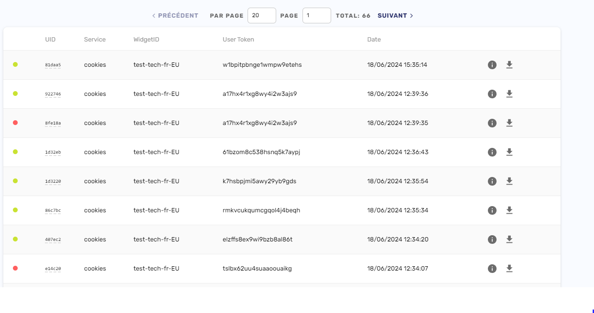

# FrontEnd dev - Tests

## 1. Instruction for start the project.

- To launch the application, simply clone the Github repository from this address: XXX 
- Once it has been cloned, go to the "Test-1" repository folder and launch the index.html file from a local web server or from a hosting service. 

## 2. Instructions for configuring CMP - Axeptio (axeptioConfig.js)

- First, you need to go to https://www.axept.io/fr/ and click on "Sign up free" to create an account. 
- Once your account has been created, you can access your dashboard. You create a new project, you are asked the url of your website and what you want to call your new project.
- We'll use the free one for our test, so we'll choose "My cookie banner" and select the "Google Consent Mode v2 ready" cookie configuration.
- We can now personalise the messages, the position linked to our cookie, etc.
- There's a register of consent when a user accepts or refuses cookies 





- To integrate Axeptio into the code, you first need to retrieve the Axeptio script:

```js
<script>
window.axeptioSettings = {
  clientId: "6671adbed1e616c427b47a81", // Project ID
  cookiesVersion: "test-tech-en-EU", // Project name
  googleConsentMode: {
    default: {
      analytics_storage: "denied",
      ad_storage: "denied",
      ad_user_data: "denied",
      ad_personalization: "denied",
      wait_for_update: 500
    }
  }
};
 
(function(d, s) {
  var t = d.getElementsByTagName(s)[0], e = d.createElement(s);
  e.async = true; e.src = "//static.axept.io/sdk.js";
  t.parentNode.insertBefore(e, t);
})(document, "script");
</script>
```

- Once I had the script, I decided to split it into two modules. axeptioConfig.js and axeptioLoader.js implemented as follows : 

```js
// axeptioLoader
import axeptioConfig from './axeptioConfig.js'; // We import our axeptio config from axeptioConfig.js

const axeptioLoader = {
    init: function () {
        window.axeptioSettings = axeptioConfig; // the window method allows us to access axeptioSettings from anywhere (global scope)
        this.loadAxeptioScript(); // We launch our loadAxeptioScript method, which starts the script.
    },
    loadAxeptioScript () {
        (function (d, s) {
            var t = d.getElementsByTagName(s)[0], e = d.createElement(s);
            e.async = true;
            e.src = "//static.axept.io/sdk.js";
            t.parentNode.insertBefore(e, t);
        })(document, "script");
    }
};

export default axeptioLoader;


// axeptioConfig

const axeptioConfig = {
    clientId: "666c2a85d05d81f57459c630",
    cookiesVersion: "test-tech-fr-EU",
    googleConsentMode: {
        default: {
            analytics_storage: "denied",
            ad_storage: "denied",
            ad_user_data: "denied",
            ad_personalization: "denied",
            wait_for_update: 500
        }
    }
};

export default axeptioConfig;
```

- Once we have created our two modules, we need to call them in our main file (app.js):

```js


/*
* Import every js files
*/
import prebidConfig from './prebidConfig.js';
import apstagConfig from './apstagConfig.js';
import googleTagConfig from './googleTagConfig.js'; 
import axeptioLoader from './axeptioLoader.js'; 

/*
* For the test I wanted to delete the cookies when the user left the page -> setupUnloadListener function
*/
const deleteAxeptioCookie = () => {
    const cookies = document.cookie.split("; ");
    for (const cookie of cookies) {
        const eqPos = cookie.indexOf("=");
        const name = eqPos > -1 ? cookie.substr(0, eqPos) : cookie;
        if (name === "axeptio_cookies") {
            document.cookie = name + "=; Path=/; expires=Thu, 01 Jan 1970 00:00:00 GMT";
        }
    }
};

const app = {
    init: () => { // Call every's app.init function when DOM is fully loaded
        axeptioLoader.init(); 
        app.setupConsentListener();
        app.setupUnloadListener(); 
    },
    setupConsentListener: () => {
        window._axcb = window._axcb || [];
        window._axcb.push((axeptio) => {
            axeptio.on("cookies:complete", (choices) => { 
                if (choices.$$googleConsentMode.ad_personalization === 'granted') { // users accept cookies then we can init every function for our ads.
                    prebidConfig.init(choices);
                    apstagConfig.init();
                    googleTagConfig.init();
                    document.getElementById('loading-image').style.display = 'none'; // remove the loader when ads are ready.
                    document.getElementById('div-2').style.display = 'block'; // Display ads.
                } else {
                    console.log('Advertising not authorised by Axeptio'); // We can put something else instead
                }
            });
        });
    },
    setupUnloadListener: () => {
        window.addEventListener("beforeunload", deleteAxeptioCookie);
    }
};

document.addEventListener("DOMContentLoaded", app.init); // When the DOM is fully loaded we start the app.init method
```

Pros : 
- I'd already done a bit of work with Axeptio during my work-study placement. 

Cons: 
- I didn't understand what the consent during the prebid setConfig was actually for if a CMP also manages it. I'd like to look into this further. 
- When prebid reloads, the cookies reappear and I can't figure out what the problem is and how to solve it.
